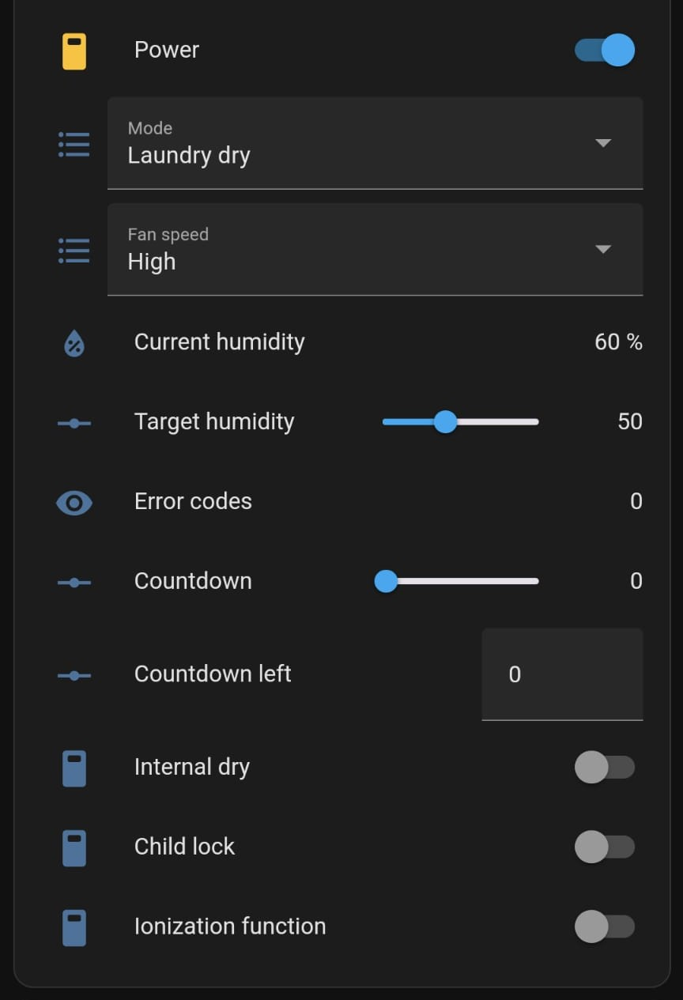

# AlecoAir D12 Home Home Assistant Integration with localtuya
AlecoAir D12 Home Dehumidifier, Home Assistant Integration with [localtuya](https://github.com/rospogrigio/localtuya).  
Full properties json file can be found [here](properties.json).

Data points mappings:

1 - switch - Power On/Off (True: On; False: Off)  
2 - select - Mode (Auto: 0; Laundy dry: 1)  
3 - sensor - Current humidity  
4 - number - Target humidity (min: 30; max: 80; step: 5)  
5 - switch - Ionization function (False: Off; True: On)  
6 - select - Fan speed (0: High; 1: Low)  
7 - switch - Child lock (True: Locked; False: Unlocked)  
11 - number - Fault codes (4: defrost, 8: full tank, others?) 
12 - number - Countdown (min: 0; max: 24)  
13 - number - Countdown left (min: 0; max: 1440)  
101 - switch - Internal dry (True: On; False: Off)  
102 - sensor - Pump (True: On; False: Off)  

